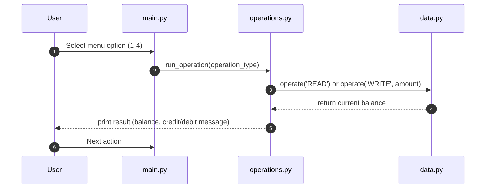

# Modernizing COBOL → Python: Account Management System

## 1️ Objective
This project migrates a COBOL account management program to Python.
The goal is to preserve the business logic while improving security, robustness, and user experience.

---

## 2️ What has been preserved from COBOL

| Feature | COBOL Behavior | Python Behavior |
|---------|----------------|----------------|
| **Balance display** | Leading zeros, 2 decimals (`001000.00`) | Format `09.2f` to display balance with leading zeros and two decimals (`001000.00`) |
| **Maximum balance** | COBOL truncated to 6 digits before the decimal | Strict limit of `999999.99` on the balance |
| **Available operations** | 1 = View Balance, 2 = Credit, 3 = Debit, 4 = Exit | Same menu and numbering preserved |
| **Reading/Writing balance** | DataProgram read and wrote balance with 6 digits + 2 decimals | Same mechanism with `DataProgram.operate('READ'/'WRITE')` |
| **Modularity** | Code split into `main.cob`, `operations.cob`, `data.cob` | Modular structure: `main.py`, `operations.py`, `data.py` |
| **Decimal separator** | Only `.` allowed | Python also accepts `,` as decimal separator (e.g., `1,23` → `1.23`) |
---

## 3️ What has not been preserved / improved

| Feature | COBOL Behavior | Python Behavior |
|---------|----------------|----------------|
| **Invalid input handling** | Negative numbers, multiple decimal points, letters → could result in phantom debit/credit | Strict validation: only positive numbers, at most one decimal point; spaces trimmed; clear error messages for invalid input |
| **Zero or negative amounts** | Could credit/debit 0 or negative amounts | Rejected: `"Please enter a positive number greater than zero"` |
| **Multiple decimals** | Accepted incorrectly | Rejected: `"Please enter a valid number (digits with an optional decimal point)"` |
| **Amounts exceeding COBOL limits** | Truncated to 6 digits before decimal | Rejected if operation would exceed `999999.99`; message `"Operation cancelled: balance cannot exceed 999 999.99"` |
| **Leading/trailing spaces in input** | Ignored or caused errors | Spaces are automatically stripped before processing |
| **Insufficient funds** | COBOL could allow negative balances or behave inconsistently | Python blocks the operation with `"Insufficient funds for this debit."` |
| **“Buggy” display behavior** | Credited/debited amounts could display without actual change | Python ensures balance never changes for invalid operations |
| **User menu robustness** | COBOL might crash or accept invalid menu numbers | Python rejects invalid options (anything not 1–4) with `"Unknown operation."` |
| **Non-numeric input** | Letters or multiple points could be processed as valid | Rejected with clear error message; prevents accidental balance modification |
| **Maximum balance reached** | COBOL truncated values silently | Python stops credit operations when balance would exceed `999999.99` and displays a clear message |

---

## 4️ Rules applied in Python

1. **Maximum balance**: 999,999.99. Any operation exceeding this limit is rejected.
2. **Positive amounts only**: `> 0`. Zero or negative amounts are not allowed.
3. **Input validation**: Only strings matching `\d+(\.\d+)?` or `\d+(,\d+)?` are accepted (commas are converted to dots).
4. **Balance display format**: exactly 6 digits before the decimal and 2 digits after, with leading zeros (`09.2f`, e.g. `001000.00`).
5. **User menu**: options 1–4 only; any other choice is rejected.
6. **Safety**: invalid inputs never modify the balance.

---

## 5. Project structure

```text
.
├── main.py          # User interface and menu
├── operations.py    # Credit, debit, and balance operations
├── data.py          # Balance storage management
├── unit_tests.py    # Unit tests for all functionalities
└── README.md        # Project documentation

```

## 6️ Diagram / Data Flow



## 7. Test Plan

The following table lists all test cases for the original COBOL application, including normal operations, boundary cases, and user input errors. **Actual Results** are based on Python unit test execution.

| Test Case ID | Test Case Description                  | Pre-conditions          | Test Steps                                                                 | Expected Result                                              | Actual Result | Comments |
|--------------|---------------------------------------|------------------------|---------------------------------------------------------------------------|--------------------------------------------------------------|---------------|---------|
| TC001        | View balance                           | Account with 1000.00   | 1. Select option 1 (TOTAL)                                                | Display current balance: 001000.00                          | Displayed: 001000.00 | Works as expected |
| TC002        | Credit normal amount                   | Account with 1000.00   | 1. Select option 2 (CREDIT) <br> 2. Enter 500.50                           | New balance: 001500.50                                      | Displayed: 001500.50 | Works as expected |
| TC003        | Debit normal amount                    | Account with 1000.00   | 1. Select option 3 (DEBIT) <br> 2. Enter 500.50                            | New balance: 000499.50                                      | Displayed: 000499.50 | Works as expected |
| TC004        | Debit more than balance (insufficient)| Account with 1000.00    | 1. Select option 3 <br> 2. Enter 10000                                    | Display: "Insufficient funds for this debit." <br> Balance unchanged | Displayed: Insufficient funds for this debit., Balance = 1000.00 | Matches Python behavior |
| TC005        | Credit maximum digits (6 before dec)  | Account with 1000.00 | 1. Select option 2 <br> 2. Enter 9999999.00                                | Balance truncated to 999999.99                               | Operation cancelled: balance cannot exceed 999 999.99 | Python rejects input |
| TC006        | Negative credit amount                 | Account with 1000.00   | 1. Select option 2 <br> 2. Enter -50                                      | Should display invalid input / reject operation             | Displayed: Please enter a positive number greater than zero. | Python validation |
| TC007        | Negative debit amount                  | Account with 1000.00   | 1. Select option 3 <br> 2. Enter -300                                     | Should display invalid input / reject operation             | Displayed: Please enter a positive number greater than zero. | Python validation |
| TC008        | Non-numeric input for credit           | Account with 1000.00   | 1. Select option 2 <br> 2. Enter "abc"                                     | Should reject input, display error message                  | Displayed: Please enter a valid number (digits with an optional decimal point). | Python validation |
| TC009        | Non-numeric input for debit            | Account with 1000.00   | 1. Select option 3 <br> 2. Enter "12.34.56"                                | Should reject input, display error message                  | Displayed: Please enter a valid number (digits with an optional decimal point). | Python validation |
| TC010        | Zero credit amount                     | Account with 1000.00   | 1. Select option 2 <br> 2. Enter 0                                         | Should reject input, display message                        | Displayed: Please enter a positive number greater than zero. | Python validation |
| TC011        | Zero debit amount                      | Account with 1000.00   | 1. Select option 3 <br> 2. Enter 0                                         | Should reject input, display message                        | Displayed: Please enter a positive number greater than zero. | Python validation |
| TC012        | Check leading zeros formatting         | Account with 1000.00   | 1. Select option 1                                                        | Display balance with leading zeros (001000.00)             | Displayed: 001000.00 | Works as expected |
| TC013        | Exit program                           | Any state               | 1. Select option 4                                                        | Program terminates with message "Exiting the program. Goodbye!" | Program exits with SystemExit, Message: Exiting the program. Goodbye! | Works as expected |
| TC014        | Large credit within limits             | Account with 100000.00 | 1. Select option 2 <br> 2. Enter 500000                                    | New balance = min(current + credit, 999999.99)             | Displayed: 600000.00 | Works as expected |
| TC015        | Large debit within limits              | Account with 999999.99 | 1. Select option 3 <br> 2. Enter 999999.99                                 | New balance = current - debit (should be >= 0)             | Displayed: 000000.00 | Works as expected |

**Additional Python-only test cases were added:**

- Stripping spaces before/after numeric input for credit and debit.
- Handling inputs exceeding max digits but within Python float limits.
- Rejecting zero or negative amounts consistently.
- Rejecting multiple decimal points.
- Rejecting amounts that would make the balance exceed 999,999.99.

---

### 8. Unit & Integration Tests

All functionalities of the Python account management system are covered by automated tests using `unittest`:

- **Unit tests**: test `DataProgram` and `Operations` modules in isolation.
- **Integration tests**: simulate full sessions including credit, debit, and balance display.
- **Coverage**:
  - Valid and invalid inputs (negative, zero, non-numeric, multiple decimals)
  - Maximum balance constraints
  - Insufficient funds handling
  - Leading/trailing spaces in user input
  - Display formatting (leading zeros, 2 decimals)
