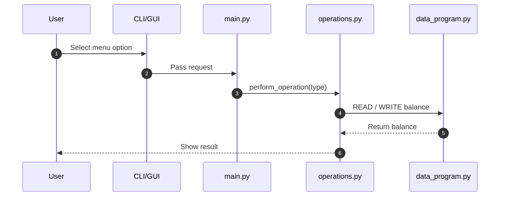
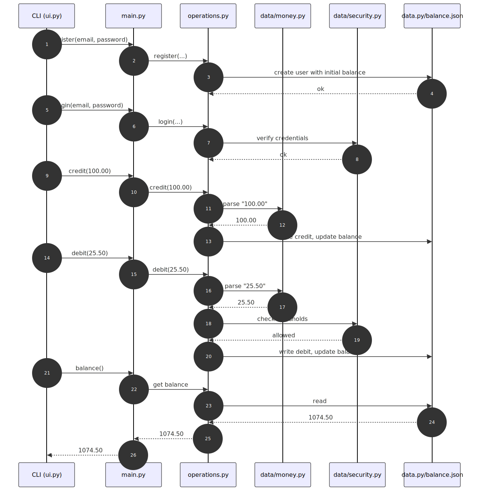

# Modernizing COBOL → Python: Account Management System

## 1. Objective
This project modernizes a legacy **COBOL account management program** into a **Python application**.
Goals:
- Preserve **100% of COBOL business logic**.
- Improve **security, robustness, maintainability, and user experience**.
- Add both **CLI** and **GUI (Tkinter)**.
- Integrate **unit tests, integration tests, and Golden Master tests**.

---

## 2. Architecture

### System Mapping
- **COBOL Original**: `main.cob`, `operations.cob`, `data.cob`
- **Python Modern**:
  - `main.py` (orchestrator)
  - `operations.py` (business rules)
  - `data_program.py` (storage & integrity)
  - `ui.py` (CLI)
  - `gui.py` + `gui_components/` (GUI)
  - `money.py` (decimal handling)

**Simplified Data Flow:**

### System map

show the major modules (CLI, GUI, Orchestrator, Business Rules, Data/Security, Effects) and how requests and data move between them.




### Happy path
sequence of calls for the common case, including money parsing and persistence.



### Key Components
- **Storage**: JSON backend (default) or in-memory (for tests). Atomic writes + file locking.
- **Security**: HMAC signatures with `DATA_FILE_KEY` or `DATA_FILE_PASSPHRASE`.
- **Authorization threshold** (`TXN_THRESHOLD`): transactions above require an unlock key.
- **User authentication**: register, login, logout, PBKDF2 password hashing, login attempt lockout.
- **Golden Master Tests**: deterministic snapshots ensure behavior parity across refactors.

---

## 3. COBOL Parity

### Preserved Behaviors
- **Menu & operations:** TOTAL, CREDIT, DEBIT, EXIT (exact COBOL codes including trailing spaces)
- **Initial balance:** 1000.00
- **Display format:** fixed-width balance with 6 digits before decimal, 2 after (PIC 9(6)V99)
- **Insufficient funds validation:** debit blocked when balance is too low
- **Flow of operations:** identical to COBOL
- **Error messages:** preserved where applicable

### What has been preserved from COBOL

| Feature | COBOL Behavior | Python Behavior |
|---------|----------------|----------------|
| Balance display | Leading zeros, 2 decimals (001000.00) | Format 09.2f to display balance with leading zeros and two decimals (001000.00) |
| Maximum balance | COBOL truncated to 6 digits before the decimal | Strict limit of 999999.99 on the balance |
| Available operations | 1 = View Balance, 2 = Credit, 3 = Debit, 4 = Exit | Same menu and numbering preserved |
| Reading/Writing balance | DataProgram read and wrote balance with 6 digits + 2 decimals | Same mechanism with DataProgram.operate('READ'/'WRITE') |
| Modularity | Code split into main.cob, operations.cob, data.cob | Modular structure: main.py, operations.py, data.py |
| Decimal separator | Only . allowed | Python also accepts , as decimal separator (e.g., 1,23 → 1.23) |

### What has not been preserved / improved

| Feature | COBOL Behavior | Python Behavior |
|---------|----------------|----------------|
| Invalid input handling | Negative numbers, multiple decimal points, letters → could result in phantom debit/credit | Strict validation: only positive numbers, at most one decimal point; spaces trimmed; clear error messages for invalid input |
| Zero or negative amounts | Could credit/debit 0 or negative amounts | Rejected: "Please enter a positive number greater than zero" |
| Multiple decimals | Accepted incorrectly | Rejected: "Please enter a valid number (digits with an optional decimal point)" |
| Amounts exceeding COBOL limits | Truncated to 6 digits before decimal | Rejected if operation would exceed 999999.99; message "Operation cancelled: balance cannot exceed 999 999.99" |
| Leading/trailing spaces in input | Ignored or caused errors | Spaces are automatically stripped before processing |
| Insufficient funds | COBOL could allow negative balances or behave inconsistently | Python blocks the operation with "Insufficient funds for this debit." |
| “Buggy” display behavior | Credited/debited amounts could display without actual change | Python ensures balance never changes for invalid operations |
| User menu robustness | COBOL might crash or accept invalid menu numbers | Python rejects invalid options (anything not 1–4) with "Unknown operation." |
| Non-numeric input | Letters or multiple points could be processed as valid | Rejected with clear error message; prevents accidental balance modification |
| Maximum balance reached | COBOL truncated values silently | Python stops credit operations when balance would exceed 999999.99 and displays a clear message |

### Rules applied in Python
- Maximum balance: 999,999.99. Any operation exceeding this limit is rejected.
- Positive amounts only: > 0. Zero or negative amounts are not allowed.
- Input validation: Only strings matching `\d+(\.\d+)?` or `\d+(,\d+)?` are accepted (commas are converted to dots).
- Balance display format: exactly 6 digits before the decimal and 2 digits after, with leading zeros (`09.2f`, e.g. 001000.00).
- User menu: options 1–4 only; any other choice is rejected.
- Safety: invalid inputs never modify the balance.

## 4. Migration Modifications

### Language & Structure
- COBOL procedural → Python OOP classes
- PERFORM UNTIL → while loop
- COBOL CALL → direct method invocation
- STOP RUN → natural program termination with `if __name__ == "__main__":`

### Data & Precision
- COBOL PIC 9(6)V99 → Python Decimal
- Validations: max 999999.99, max 2 decimal places, positive only

### Input/Output
- COBOL ACCEPT/DISPLAY → Python `input()/print()`
- Error handling with re-prompting

### Storage
- COBOL pass-by-reference → Python return values
- Extra helper methods: `read_balance()`, `write_balance()`, `get_storage_info()`

### Robustness
- Full input validation (negatives, non-numeric, multiple decimals rejected)
- Clear error messages
- Added tests & debugging hooks

## 5. Improvements Over COBOL
- Security: password hashing, unlock key, signed ledger
- User experience:
  - Rejects invalid inputs with clear feedback
  - Accepts both `,` and `.` as decimal separators
  - Strips leading/trailing spaces
- Error handling: invalid input never corrupts balance
- Testing: unit + integration + Golden Master tests

## 6. Project Structure

```text
.
├── main.py               # Orchestrator
├── operations.py         # Credit/debit logic
├── data_program.py       # Storage API
├── money.py              # Decimal parsing
├── ui.py                 # CLI
├── gui.py + gui_components/  # GUI
├── tests/                # Unit & GM tests
└── legacy/ (main.cob, operations.cob, data.cob)
```

## 7. Validation & Tests

### Test Plan Summary
- **Planned cases**: 26
- **Automated**: 39
- **Coverage**: 98% (operations.py: 98%, data_program.py: 97%)
- **Execution time**: 0.16s
- **Result**: 100% PASSED

### Types of Tests
- **Unit tests**: balance handling, operations, storage.
- **Integration tests**: simulate full sessions.
- **Golden Master tests**: snapshot vs expected results.

### Verified Scenarios
- Invalid inputs: negative, zero, letters, multiple decimals.
- Insufficient funds.
- COBOL-compatible formats.
- Balance persistence.
- Menu loop & clean exit.

### Migration Result
- **Functional equivalence** with COBOL: 100%.
- **Performance**: fast, stable, no memory leaks.
- **Code quality**: maintainable, tested, documented.
- **Deployment readiness**:  approved.

---

## 8. Architecture 4 — Golden Master

This is the “Golden Master” architecture: a reference implementation whose behavior is treated as the canonical source of truth. Any refactor or modernization is validated against the Golden Master via snapshot-style tests to ensure 100% parity with expected inputs/outputs and state transitions.

- Purpose: preserve behavior while enabling safe refactors
- Scope: menu flow, credit/debit rules, formatting, storage I/O
- Guarantee: invalid inputs never mutate state; all outputs are deterministic



Key idea: keep business logic separated (`operations.py`) from storage (`data.py`) and orchestration (`main.py`), then lock behavior with tests acting as the Golden Master. Any change must keep outputs identical for the same inputs.


## 9. Deployment & Usage

### Quickstart
```bash
cd node-accounting-app
python3 main.py
python3 run_gui.py
```
### Configuration (environment variables)
- `DATA_STORAGE` = json | memory
- `BALANCE_FILE` = path to ledger file
- `INITIAL_BALANCE` = e.g. "1000.00"
- `TXN_THRESHOLD` = e.g. "500"
- `LOGIN_MAX_ATTEMPTS` = 5
- `DATA_FILE_KEY` or `DATA_FILE_PASSPHRASE` for HMAC signing

### User Workflow
1. **Register** (email + password) → receive unlock key.
2. **Login** → access the menu.
3. **Credit/Debit** → operations checked against threshold and integrity rules.
4. **Unlock** → required for blocked transactions or login recovery.